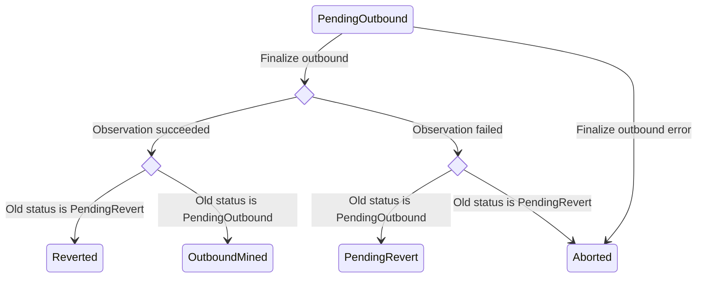
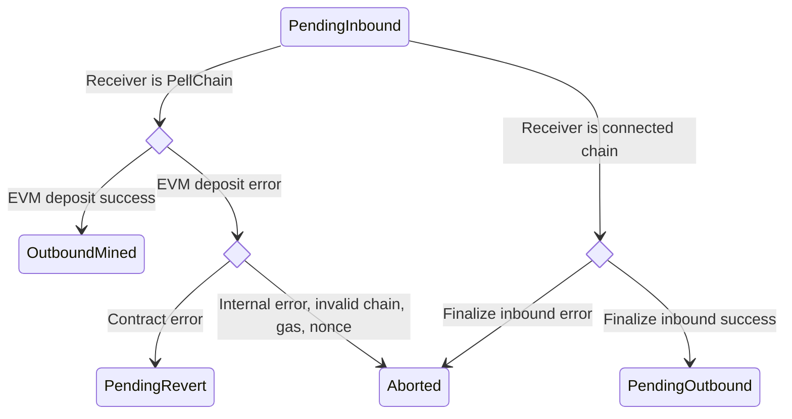

# Messages

## MsgAddToOutTxTracker

AddToOutTxTracker adds a new record to the outbound transaction tracker.
only the admin policy account and the observer validators are authorized to broadcast this message without proof.
If no pending xmsg is found, the tracker is removed, if there is an existed tracker with the nonce & chainID.

```proto
message MsgAddToOutTxTracker {
	string creator = 1;
	int64 chain_id = 2;
	uint64 nonce = 3;
	string tx_hash = 4;
	proofs.Proof proof = 5;
	string block_hash = 6;
	int64 tx_index = 7;
}
```

## MsgAddToInTxTracker

AddToInTxTracker adds a new record to the inbound transaction tracker.

```proto
message MsgAddToInTxTracker {
	string creator = 1;
	int64 chain_id = 2;
	string tx_hash = 3;
	coin.CoinType coin_type = 4;
	proofs.Proof proof = 5;
	string block_hash = 6;
	int64 tx_index = 7;
}
```

## MsgRemoveFromOutTxTracker

RemoveFromOutTxTracker removes a record from the outbound transaction tracker by chain ID and nonce.

Authorized: admin policy group 1.

```proto
message MsgRemoveFromOutTxTracker {
	string creator = 1;
	int64 chain_id = 2;
	uint64 nonce = 3;
}
```

## MsgVoteGasPrice

VoteGasPrice submits information about the connected chain's gas price at a specific block
height. Gas price submitted by each validator is recorded separately and a
median index is updated.

Only observer validators are authorized to broadcast this message.

```proto
message MsgVoteGasPrice {
	string creator = 1;
	int64 chain_id = 2;
	uint64 price = 3;
	uint64 block_number = 4;
	string supply = 5;
}
```

## MsgVoteOnObservedOutboundTx

VoteOnObservedOutboundTx casts a vote on an outbound transaction observed on a connected chain (after
it has been broadcasted to and finalized on a connected chain). If this is
the first vote, a new ballot is created. When a threshold of votes is
reached, the ballot is finalized. When a ballot is finalized, the outbound
transaction is processed.

If the observation is successful, the difference between pell burned
and minted is minted by the bank module and deposited into the module
account.

If the observation is unsuccessful, the logic depends on the previous
status.

If the previous status was `PendingOutbound`, a new revert transaction is
created. To cover the revert transaction fee, the required amount of tokens
submitted with the Xmsg are swapped using a Uniswap V2 contract instance on
PellChain for the PRC20 of the gas token of the receiver chain. The PRC20
tokens are then
burned. The nonce is updated. If everything is successful, the Xmsg status is
changed to `PendingRevert`.

If the previous status was `PendingRevert`, the Xmsg is aborted.



Only observer validators are authorized to broadcast this message.

```proto
message MsgVoteOnObservedOutboundTx {
	string creator = 1;
	string xmsg_hash = 2;
	chains.ReceiveStatus status = 3;
	int64 outTx_chain = 4;
	uint64 outTx_tss_nonce = 5;
	string observed_outTx_hash = 6;
	uint64 observed_outTx_blockHeight = 7;
	uint64 observed_outTx_gas_used = 10;
	string observed_outTx_effective_gas_price = 11;
	uint64 observed_outTx_effective_gas_limit = 12;
}
```

## MsgVoteInboundBlock

```proto
message MsgVoteInboundBlock {
	string creator = 1;
	BlockProof block_proof = 2;
}
```

## MsgVoteOnObservedInboundTx

VoteOnObservedInboundTx casts a vote on an inbound transaction observed on a connected chain. If this
is the first vote, a new ballot is created. When a threshold of votes is
reached, the ballot is finalized. When a ballot is finalized, a new Xmsg is
created.

If the receiver chain is PellChain, `HandleEVMDeposit` is called. If the
tokens being deposited are PELL, `MintPellToEVMAccount` is called and the
tokens are minted to the receiver account on PellChain. If the tokens being
deposited are gas tokens or ERC20 of a connected chain, ZRC20's `deposit`
method is called and the tokens are deposited to the receiver account on
PellChain. If the message is not empty, system contract's `depositAndCall`
method is also called and an omnichain contract on PellChain is executed.
Omnichain contract address and arguments are passed as part of the message.
If everything is successful, the Xmsg status is changed to `OutboundMined`.

If the receiver chain is a connected chain, the `FinalizeInbound` method is
called to prepare the Xmsg to be processed as an outbound transaction. To
cover the outbound transaction fee, the required amount of tokens submitted
with the Xmsg are swapped using a Uniswap V2 contract instance on PellChain
for the ZRC20 of the gas token of the receiver chain. The ZRC20 tokens are
then burned. The nonce is updated. If everything is successful, the Xmsg
status is changed to `PendingOutbound`.



Only observer validators are authorized to broadcast this message.

```proto
message MsgVoteOnObservedInboundTx {
	string creator = 1;
	string sender = 2;
	int64 sender_chain_id = 3;
	string receiver = 4;
	int64 receiver_chain = 5;
	string in_tx_hash = 6;
	uint64 in_block_height = 7;
	uint64 gas_limit = 8;
	string tx_origin = 9;
	uint64 event_index = 10;
	InboundPellEvent pell_tx = 11;
}
```

## MsgUpdateTssAddress

UpdateTssAddress updates the TSS address.

```proto
message MsgUpdateTssAddress {
	string creator = 1;
	string tss_pubkey = 2;
}
```

## MsgMigrateTssFunds

MigrateTssFunds migrates the funds from the current TSS to the new TSS

```proto
message MsgMigrateTssFunds {
	string creator = 1;
	int64 chain_id = 2;
	string amount = 3;
}
```

## MsgAbortStuckXmsg

AbortStuckXmsg aborts a stuck Xmsg
Authorized: admin policy group 2

```proto
message MsgAbortStuckXmsg {
	string creator = 1;
	string xmsg_index = 2;
}
```

## MsgUpdateRateLimiterFlags

UpdateRateLimiterFlags updates the rate limiter flags.
Authorized: admin policy operational.

```proto
message MsgUpdateRateLimiterFlags {
	string creator = 1;
	RateLimiterFlags rate_limiter_flags = 2;
}
```

